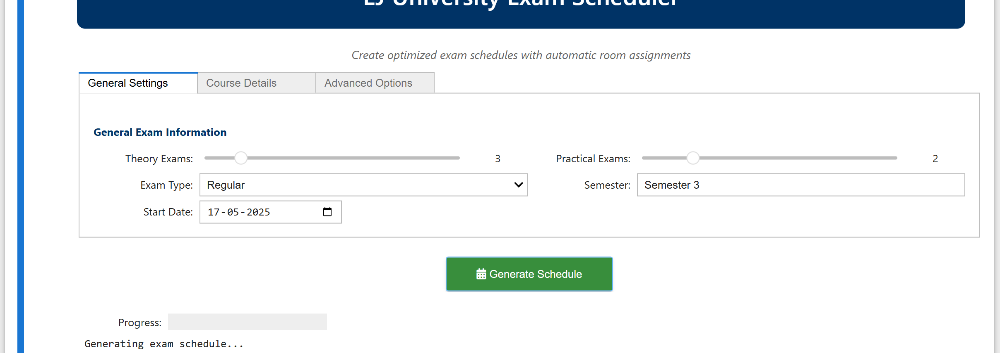

# Exam Schedule Generator

A command-line user interface (CUI) application for generating optimized exam schedules with automatic room assignments for educational institutions.

## Overview

This application helps educational administrators create conflict-free exam schedules by:
- Automatically assigning dates, rooms, and time slots to exams
- Handling both theory and practical exams
- Avoiding scheduling conflicts
- Generating downloadable Excel and PDF schedules
- Providing an interactive user interface for customization




## Features

- **Interactive UI**: Easy-to-use interface with sliders, dropdowns, and input fields
- **Constraint Solver**: Uses Google OR-Tools constraint programming solver to create optimal schedules
- **Customizable Parameters**:
  - Number of theory and practical exams
  - Exam type (Regular, Remedial, Internal)
  - Semester information
  - Start date selection
  - Course names and details
- **Automatic Room Assignment**: Assigns appropriate rooms for theory exams and labs for practical exams
- **Export Options**: Generate professional Excel and PDF outputs
- **Conflict Avoidance**: Ensures no two exams are scheduled on the same day or in the same room

## Requirements

- Python 3.x
- Required packages:
  - pandas
  - ipywidgets
  - ortools
  - fpdf
  - matplotlib

## Installation

1. Clone this repository:
   ```
   git clone https://github.com/webKing021/exam-schedule-generator-python-jupyter/.git
   cd exam-schedule-generator
   ```

2. Install the required packages:
   ```
   pip install ortools pandas ipywidgets fpdf matplotlib
   ```

3. Run the Jupyter notebook:
   ```
   jupyter notebook Exam-Schedule-Generator.ipynb
   ```

## Usage

1. Set the number of theory and practical exams using the sliders
2. Select the exam type (Regular, Remedial, Internal)
3. Enter the semester information
4. Choose a start date for the exam schedule
5. Enter the names of theory and practical courses
6. Click "Generate Schedule" to create the exam timetable
7. Download the schedule in Excel or PDF format

## How It Works

The application uses constraint programming to solve the complex scheduling problem:

1. **Data Collection**: Gathers user inputs for courses, dates, and constraints
2. **Model Creation**: Creates a constraint satisfaction problem model
3. **Constraint Application**: Applies rules like "no two exams on the same day"
4. **Solving**: Uses the OR-Tools solver to find an optimal solution
5. **Output Generation**: Creates formatted schedules in multiple formats

## Database Integration

The application supports both SQLite (default) and MySQL database backends for storing and retrieving schedule data. Configuration settings for database connections can be customized as needed.

## License

[MIT License](LICENSE)

## Author

Developed by Krutarth Raychura.

## Acknowledgments

- Google OR-Tools for the constraint programming solver
- Jupyter for the interactive notebook environment
